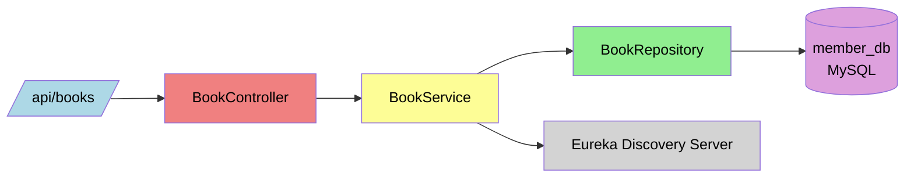

#  Member Service

The Member Management Service is a standalone Spring Boot microservice responsible for handling member registration, profile updates, and managing the membership lifecycle in a Library Management System. It is designed for modularity, scalability, and integration within a microservices ecosystem via Eureka Discovery and Spring Cloud Gateway.
---
##  Features

- Register new members
- Search members by name or status
- Retrieve member by ID or email
- Update member details and status
- Delete or deactivate accounts

---

## Tech Stack

- Java 
- Spring Boot 
- Spring Data JPA
- MySQL
- Springdoc OpenAPI (Swagger)
- Eureka Discovery Client

---
**## Folder Structure**

src/
└── main/
    ├── java/
    │   └── com.library.member/
    │       ├── controller/
    │       ├── dto/
    │       ├── entity/
    │       ├── repository/
    │       └── service/
    └── resources/
        └── application.properties

---

##  REST API Endpoints

| Method | Endpoint               | Description               |
|--------|------------------------|---------------------------|
| POST   | `/api/members`         | Register a new member     |
| PUT    | `/api/members/{id}`    | Update existing member    |
| GET    | `/api/members/{id}`    | Retrieve member by ID     |
| GET    | `/api/members?email=`  | Retrieve member by email  |

---

##  Data Model

### Member Entity

| Field             | Type     | Description                  |
|-------------------|----------|------------------------------|
| `memberId`        | BIGINT   | Primary key, auto-generated  |
| `name`            | VARCHAR  | Member's full name           |
| `email`           | VARCHAR  | Must be unique               |
| `phone`           | VARCHAR  |                              |
| `address`         | VARCHAR  |                              |
| `membershipStatus`| ENUM     | `ACTIVE` / `INACTIVE`        |
| `registrationDate`| DATE     | Member's onboarding date     |

---
##  Architecture Diagram



_This diagram illustrates the layered architecture:_

- API Gateway routes requests
- MemberController handles HTTP requests
- Business logic sits in MemberService
- Data access is handled by MemberRepository
- Data is persisted to a MySQL database
- The service is registered with Eureka for discovery

## Component Diagram


## Class Diagram


## Flow Diagram


## Database schema


---

##  API Endpoints

| Method | URL                               | Description              |
|--------|------------------------------------|--------------------------|
| GET    | `/api/members`                    | Get all members          |
| GET    | `/api/members/{id}`               | Get member by ID         |
| GET    | `/api/members/email/{email}`      | Get member by email      |
| GET    | `/api/members/status/{status}`    | Get members by status    |
| GET    | `/api/members/search?name=xyz`    | Search by name           |
| POST   | `/api/members`                    | Create new member        |
| PUT    | `/api/members/{id}`               | Update member info       |
| PUT    | `/api/members/{id}/status`        | Update membership status |
| DELETE | `/api/members/{id}`               | Delete member            |

---

##  Run Locally

```bash
# Clone this repo

# Navigate to the folder
cd member-service

# Build and run
mvn clean install
mvn spring-boot:run

